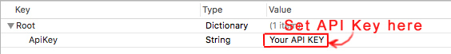

# MapsApp
This App simple presents how to use Apple MapKit &amp; GoogleMaps (for iOS)

# Important Setting
You MUST have your own GoogleMaps API Key first, then set it as the value of 'ApiKey' key in GoogleMaps_API_Key.plist.

